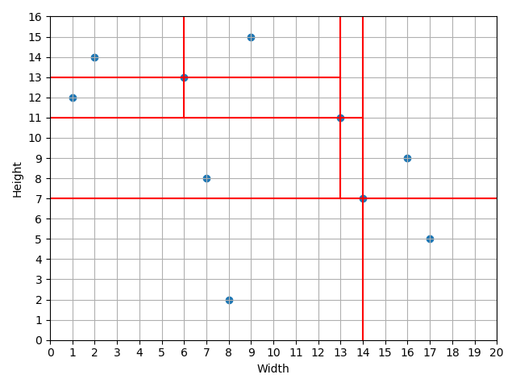

# Analiza Algorytmów - Projekt końcowy

<p align="right"> Zbigniew Dynowski<br>293087</p>

## Treść zadania:

> Dany jest obszar prostokątny **R** o bokach *a*, *b* zgodnych z osiami układu współrzędnych i zbiór **P** punktów wewnątrz tego obszaru (wszystkie współrzędne całkowite). *Działką* w **R** będziemy nazywać prostokąt **D** o następujących cechach:
>
> 1. **D** jest całkowicie zawarty w **R**;
> 2. Boki **D** są zgodne z osiami układy współrzędnych;
> 3. Wewnątrz **D** znajduje się dokładnie jeden punkt zbioru **P**;
> 4. Boki **D** muszą przylegać do brzegu **R** albo zawierać punkt(y) z **P**.
>
> Należy opracować algorytm wyznaczający *maksymalną* liczbę działek w **R**.

## Przyjęte założenia:

Zbiór punktów **P**:

* Nie może zawierać punktów leżących na krawędziach obszaru **R**;
* Żadne dwa różne punkty nie mogą mieć takiej samej wartości współrzędnej;
* Z tego wynika, że może istnieć co najwyżej `min(a, b) - 1` punktów w obszarze **R**.

Sposób podziału obszaru **R**:

Obszar **R** dzielony jest jednocześnie dwiema prostymi wzdłuż osi *X* i *Y* układu współrzędnych, względem ustalonego punktu przecięcia, wybranego ze zbioru **P**. Cięcia przebiegają przez cały *najmniejszy* obszar otaczający dany punkt podziału.



## Rozwiązanie problemu:

Rozwiązanie oparte jest na zasadzie *dziel i rządź*. Początkowy problem dzielony jest na mniejsze, aż do momentu, gdy rozwiązanie staje się trywialne. W tym celu potrzebne jest wprowadzenie pojęcia **Największej Liczby Możliwych Działek (NLMD)** dla danej liczby punktów w obszarze. Jest to optymistycznie szacowana liczba działek przy najlepszym możliwym rozłożeniu punktów. 

Dla przyjętego sposobu podziału obszaru **R** występuje następująca zależność:
```
1 punkt     -->  1 działka ───┐
2 punkty    -->  1 działka ───┼──> Zarówno maksymalna jak i minimalna liczba działek
3 punkty    -->  2 działki ───┘
4 punkty    -->  3 działki ──────┐
5 punktów   -->  4 działki ──────┤
6 punktów   -->  4 działki ──────┤
7 punktów   -->  5 działek ──────┼──> NLMD
8 punktów   -->  6 działek ──────┤
9 punktów   -->  7 działek ──────┤
10 punktów  -->  7 działek ──────┘
```


Można zauważyć, że w najbardziej optymistycznym wariancie po dodaniu kolejnych 4 punktów do **R** z jednej działki powstają cztery.

Ogólny wzór na NLMD dla n > 4:

`floor(n / 4) * 3 + correction[n % 4]`, gdzie:

* n jest liczbą naturalną;
* correction[0] = 0, correction[1] = 1, correction[2] = 1, correction[3] = 2.

Problem rozwiązywany jest rekurencyjnie, aż do momentu rozpatrywania obszaru z <= trzema punktami lub do momentu, gdy obliczona liczba działek dla danych punktów przecięć jest równa NLMD dla danej liczby punktów. 

### Algorytm rozwiązania:

1. Sprawdź, czy można wyjść z rekurencji, jeśli tak to zwróć obliczoną liczbę działek i listę z punktami przecięcia.
2. Dla każdego punktu w danym obszarze wyznacz NMLD, gdyby został on punktem przecięcia.
3. Każdy rezultat zapisz w kolejce priorytetowej.
4. Z kolejki wybierz punkt o max(NLMD) i uczyń go punktem przecięcia.
5. Wyznacz obszary powstałe po dokonaniu przecięcia.
6. Uruchom algorytm rekurencyjnie dla obszarów powstałych po przecięciu.
7. Porównaj uzyskany wynik z najlepszym obecnie, zapisz nowy i punkty cięcia prowadzące do niego jeśli okazał się lepszy.
8. Jeśli uzyskany wynik jest >= NLMD dla kolejnego punktu do rozpatrzenia to zakończ algorytm i zwróć wynik i cięcia do niego prowadzące.
9. Jeśli uzyskany wynik jest < NLMD dla kolejnego punktu, to uczyń kolejny punkt punktem przecięcia i przejdź do kroku 5.

W celu optymalizacji, powtarzające się przy obliczeniach zbiory punktów mogą być umieszczone w słowniku.

## Tryby aktywacji:

#### Tryb 1 - pobierz dane z pliku, flaga *-m1*
* *-fin* - nazwa pliku, z którego wczytywane zostaną dane
* *-fout* - nazwa pliku, do którego zapisywany zostanie wynik

#### Tryb 2 - wygeneruj instancję problemu i rozwiąż, flaga *-m2*
* *-ht* - wysokość obszaru **R**
* *-w* - szerokość obszaru **R**
* *-n* - liczba punktów do wygenerowania

#### Tryb 3 - przeprowadź proces testowania z pomiarem czasu dla rosnącego problemu i porównanaj ze złożonością teoretyczną, flaga *-m3*
* *-ht* - początkowa wysokość obszaru **R**
* *-w* - początkowa szerokość obszaru **R**
* *-n* - początkowa liczba punktów do wygenerowania
* *-s* - wartość, o jaką rosną początkowe wielkości co iterację
* *-k* - liczba iteracji
* *-r* - liczba powtórzeń na iterację

## Stosowane algorytmy i struktury danych:

**heapq** - struktura danych realizująca w projekcie funkcję kolejki proirytetowej, dla rozwiązania, które 
zastosowałem wystarczy, że zawsze będziemy w stanie otrzymać element o największej wartości priorytetu, reszta elementów 
nie musi być stale posortowana, dokumentacja: [https://docs.python.org/3.0/library/heapq.html](https://docs.python.org/3.0/library/heapq.html)

**dictionary** - struktura wykorzystana do przechowywania już obliczonych wyników dla pewnych obszarów, w projekcie kluczem
jest hash danego obiektu *Zone*, a wartością przechowywaną jest obliczona liczba działek oraz kolejne punkty cięć 
prowadzące do takiego rezultatu, dokumentacja: [https://docs.python.org/3/tutorial/datastructures.html#dictionaries](https://docs.python.org/3/tutorial/datastructures.html#dictionaries)

## Drzewo plików:
```
.
├── images - pliki obrazów wykorzystanych w README
│   ├── optymistyczne-rozlozenie.png
│   └── sposob-podzialu.png
│
├── src - pliki źródłowe programu
│   ├── classes - folder z napisanymi klasami
|   |   ├── point_of_intersection.py - klasa przechowująca dane w przypadku cięcia względem wskazanego punktu
│   |   └── zone.py - klasa przechowująca informacje o wskazanym obszarze
|   |
│   ├── modes - folder z trybami programu
│   │   ├── mode_1.py - realizacja wczytywania danych z pliku
│   │   ├── mode_2.py - realizacja generowania danych na podstawie flag
|   |   └── mode_3.py - realizacja testowania czasu działania algorytmu  
|   |
│   ├── utilities - folder z plikami pomocniczymi
│   |   ├── cli.py - realizacja interfejsu wiersza poleceń
│   │   ├── field_calculator.py - służy do obliczania największej możliwej liczby działek
|   |   └── graphic_solution.py - realizacja graficznej reprezentacji wyniku końcowego
|   |
|   ├── main.py - plik uruchomieniowy
|   └── test_results.txt - plik z wynikami przeprowadzonych testów z flagami [-m3 -w 30 -ht 40 -n 28 -s 5 -k 30 -r 5]
|
└── tests - folder z testowymi plikami tekstowymi dla trybu 1 
    ├── test - test dla 10 punktów, oczekiwany rezultat - 7
    ├── test2 - test dla 13 punktów, oczekiwany rezultat - 9
    ├── test3 - test dla 17 punktów, oczekiwany rezultat - 11
    └── test_48s_without_dictionary - przykład wykonujący sie 48s bez wykorzystania słownika i mniej niż 1s po wykorzystaniu
```


